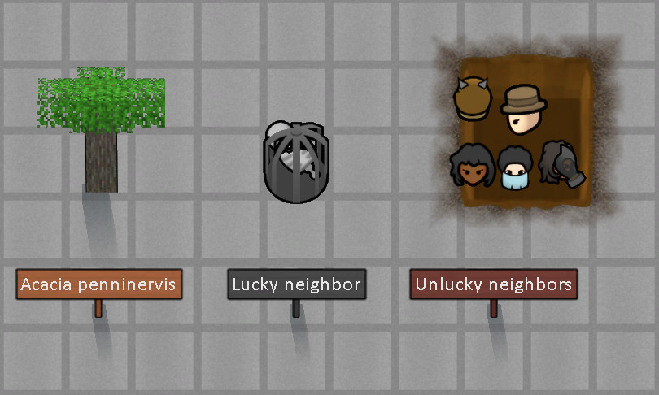

# Blocky Signs

Not official Minecraft product. Not approved by or associated with Mojang or Microsoft.

## Sign

Stuffable signs that can display a custom text with a custom color.
Sign width is automagically adjusted to accomodate contents.
Font size & other options changeable in mod settings.

### killer feature

 

Signs can render C# code expressions! The possibilities are endless!
By default it's turned off in mod's settings.
Performance is cool - under the hood it gets compiled into CIL and runs superfast.
Offscreen / zoomed out signs code does not gets executed.
I recommend you to try **${GenText.RandomSeedString}** - looks very cool :)

## Wall Sign

Same as regular one, but you can stick it to any surface.
Label text:

    CanDispenseNow: ${parent.Position.GetEdifice(Find.CurrentMap).CanDispenseNow}

## Frames

### You can build a beautiful museum

(Things shown are from [Fantastic Collectables](https://steamcommunity.com/sharedfiles/filedetails/?id=1678192680) mod)

Frames have their own beauty and quality that.
Additional beauty from displayed item is calculated as maximum of its own beauty or monetary value x0.25.
Labels:

    ${parent.Position.GetRoom(Find.CurrentMap).GetRoomRoleLabel()}

    Temp: ${Mathf.RoundToInt(parent.Position.GetRoom(Find.CurrentMap).Temperature)}

    Wealth: ${Mathf.RoundToInt(parent.Position.GetRoom(Find.CurrentMap).GetStat(RoomStatDefOf.Wealth))}

### Or a scary room of fear:

If [b]Ideology[/b] is active you can put a skull or a small dead animal into a frame, and it will induce terror.
Just like the vanilla skullspike, but better.

### Or just put them on top of your favorite pawn's dresser:

Small frames fit perfectly on top of dressers and bed tables.

All frames act like a standard containers, but can hold just a single item.
Use [Flickable Storage](https://steamcommunity.com/sharedfiles/filedetails/?id=2497907804) if you want to lock items within frames.
Contained items can be rotated in 45° increments, as the original minecraft ones.

### Verified compatible/supported mods

- [LWM's Deep Storage](https://steamcommunity.com/sharedfiles/filedetails/?id=1617282896)
- [Bill Doors' Framework](https://steamcommunity.com/sharedfiles/filedetails/?id=2897160312)

### You may also like...

https://github.com/zed-0xff/RW-BlockySigns

## Support me

 or [Patreon](https://www.patreon.com/zed_0xff)
